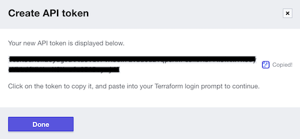

# TFC Infra
[Hashicorp tutorial](https://learn.hashicorp.com/tutorials/terraform/cloud-sign-up?in=terraform/cloud-get-started) \
This is a Terraform configuration that will create an EC2 instance in your AWS account. \
TFC workspace: `julieerle-test-workspace`

## Why use Terraform Cloud?
- Supports multiple users
- Hashicorp mananged infra

## What is a Workspace
A Workspace is the basic unit of Terraform Cloud infrastructure configuration. It includes:
- tf config
- env vars
- input vars
- state files

## Workflow
1. `terraform login` to get API token\
    \
2. Write config files
3. Commit to version control
4. Select workspace
5. Configure vars
6. Plan and apply
